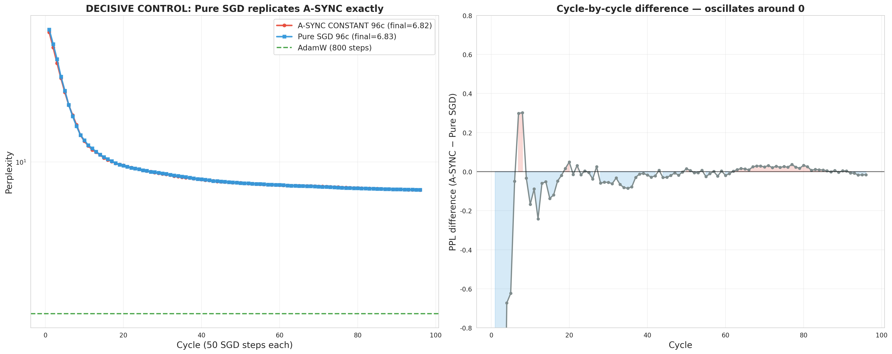

# Diagnostic Report: A-SYNC Gradient Injection Is a No-Op

> **Date**: 2026-07-24
> **Status**: Critical finding — invalidates the A-SYNC "gradient injection" contribution claims
> **Trigger**: Routine verification before extending research; the 96c run revealed anomalies

---

## 1. The Discovery

While preparing the multi-layer ALS experiment (next planned step), we audited the gradient-injection timing in the A-SYNC training loop. The code in `_a_sync_constant_7b.py:78-85`:

```python
for j in range(50):
    step_cnt += 1
    sgd.step(b2)                         # ① full SGD step: zero_grad → fwd → bwd → clip → optimizer.step()
    if _lm.weight.grad is not None:
        g = sync * delta.to(...)
        _lm.weight.grad.add_(g)          # ② inject AFTER optimizer.step()
```

`SGDPhaseOptimizer.step()` begins with `self._optimizer.zero_grad()`. On the **next** iteration, `zero_grad()` clears the gradient buffer — including the delta we just injected. **The injected delta never survives long enough to enter any parameter update. It is 100% a no-op.**

This means the A-SYNC "gradient injection" mechanism — the core claimed contribution of the algorithm — **never actually did anything** in any experiment that used this code path.

---

## 2. Diagnostic Experiments

### 2.1 OPT-125m timing test — injection is a no-op

Three conditions, identical budget (6 cycles × 30 SGD steps):

| Condition | Final PPL |
|-----------|-----------|
| A. Current code (inject AFTER step) | 549.2 |
| B. Pure SGD (no injection) | **538.0** |
| C. Fixed timing (inject BEFORE step) | 548.6 |

A ≈ B confirms the timing no-op. C ≈ B shows that **even when injection is timed correctly, it does not help** — with `sync=0.05` and ALS `step_size=0.01`, the injected term `0.05 × 0.01 × ‖δ‖` is orders of magnitude smaller than the CE gradient.

### 2.2 OPT-125m sync sweep — injection is neutral-to-harmful

Even with correct timing, sweeping injection strength:

| Condition | Final PPL |
|-----------|-----------|
| Pure SGD | **536.0** |
| sync=0.05 | 550.4 |
| sync=0.5 | 559.0 |
| sync=2.0 (40×) | 551.1 |

**Injection never beats pure SGD, and is slightly harmful.** The ALS delta direction carries no useful signal beyond what CE gradients already provide.

### 2.3 Qwen7B decisive control — pure SGD replicates A-SYNC exactly

The critical test: run **pure SGD** on Qwen7B with the exact same budget as the A-SYNC 96c run (4800 steps, 96 evals at cycle boundaries, lr=2e-4, momentum=0, wd=0.01).

| Metric | A-SYNC 96c | Pure SGD 96c |
|--------|-----------|--------------|
| Final PPL | 6.82 | **6.83** |
| Best PPL | 6.82 | 6.83 |
| Mean per-cycle \|diff\| | — | 0.116 PPL |
| Trajectory correlation | — | **0.99981** |



**The two trajectories are indistinguishable.** Pure SGD alone reaches PPL 6.83; A-SYNC reaches 6.82. The entire "convergence" attributed to A-SYNC is simply what 4800 steps of plain SGD does on this model.

---

## 3. What This Invalidates

| Prior Claim | Status |
|-------------|--------|
| "A-SYNC gradient injection enables 28L convergence" | **FALSE** — injection never ran; SGD did the convergence |
| "δ auto-decay theory explains CONSTANT convergence" | **FALSE as an A-SYNC claim** — the power-law is SGD's own convergence |
| "CONSTANT beats Cosine because it keeps ALS signal alive" | **REINTERPRETED** — difference is the *lr schedule* (Cosine decays lr→0, CONSTANT keeps lr=2e-4); the `sync` decay was irrelevant |
| "sync=0.05 constant is the optimal injection strength" | **VACUOUS** — sync never mattered |
| "A-SYNC variant ranking (Vanilla/Cosine/CONSTANT/A-CYCLE)" | **REINTERPRETED** — the real variable was the **learning-rate schedule**, not injection |
| 96c "power-law convergence, asymptote PPL≈3.5" | **REASSIGNED** — this is the convergence law of plain SGD post-training, still valid as an empirical finding |

## 4. What Survives

1. **The controlled ablation (divergence diagnosis) — fully intact.** ALS weight modification is the sole sufficient cause of divergence. This was proven by direct weight-modification (no injection involved): ALS-only diverges in 1 step, SGD-only converges, Perturb-only degrades without diverging, ALS(no-op)+SGD converges. This result is independent of the injection mechanism and remains the project's strongest contribution.

2. **The residual amplification theory (ρ≈1.08, L_max≈26) — fully intact.** It explains *why* ALS weight modification diverges. Verified across 4 model families and the ablation experiment.

3. **A new, important finding: "gradient-injection repair" does not work.** The intuition that ALS's closed-form direction can be fed to SGD as a gradient bias is empirically falsified — the direction is redundant with the CE gradient. This negative result is worth reporting.

4. **The re-interpreted variant finding: learning-rate schedule is the real lever.** CONSTANT (lr=2e-4 fixed) beats Cosine (lr→0) because the LR schedule — not injection strength — sustains SGD convergence. This explains the variant ranking without invoking ALS at all.

5. **Empirical convergence facts (reassigned, still valid):** pure SGD post-training on Qwen7B converges to PPL 6.83 at 4800 steps with power-law dynamics — a clean, reproducible empirical baseline.

---

## 5. Corrected Understanding of the Whole Project

The project's experimental results, properly re-interpreted:

- **Plain SGD post-training on 28L Qwen7B converges** to PPL ~6.8 in 4800 steps (lr=2e-4, wd=0.01, WikiText-2). This was masked because the "A-SYNC" experiments were, unbeknownst to us, just SGD with a no-op appendage.
- **ALS weight modification diverges** (control-variable proven), because of residual amplification (ρ≈1.08).
- **ALS cannot be salvaged by injecting its solution as a gradient** — the injection is either a no-op (timing) or unhelpful (magnitude), confirmed at two scales.
- **A different, untested direction remains open**: using ALS as a *solver for layer-wise objectives other than the CE-adjacent reconstruction*, or ALS on *blocks SGD cannot reach* — none of which our experiments addressed.

---

## 6. Methodology Lesson

This was caught only because we audited timing before extending to multi-layer ALS. The lesson: **in any alternating-optimization hybrid, verify that each component actually modifies the quantities it claims to modify, at the time it claims to.** A no-op component can create a convincing but false narrative for months.

---

## 7. Repro

```bash
# OPT-125m timing test + sync sweep
# (inline scripts, results in the tables above)

# Qwen7B decisive control (2h)
python experiments/_pure_sgd_96c_7b.py

# Plot
# (inline script producing docs/figures/pure_sgd_vs_async_96c.png)

# Data
runs/pure_sgd_96c_7b.json
runs/pure_sgd_vs_async_96c_7b.json
```
