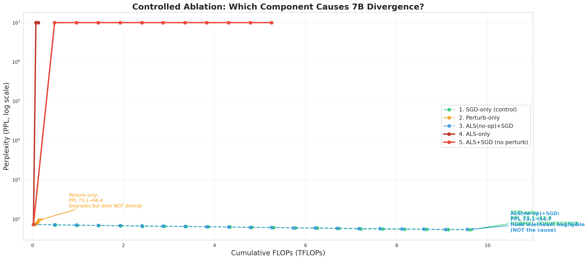
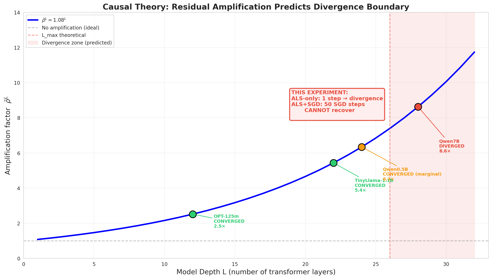

# 7B 发散原因控制变量实验报告

> **日期**: 2026-07-24  
> **模型**: Qwen2.5-7B (28层, 7.6B参数)  
> **数据**: WikiText-2, batch=2, seq=128, bfloat16  
> **GPU**: 2× NVIDIA RTX 5090 (32GB × 2)  
> **脚本**: `experiments/_diverge_cause_7b.py`  
> **数据**: `runs/diverge_cause_7b.json`

---

## 1. 实验目的

Protocol A (ALS + SGD + Perturb) 在 ≥28 层模型上 100% 发散（11/11 次 Qwen7B 独立尝试失败）。但**具体是哪个组件导致的发散**一直没有被控制变量实验严格证明。

本实验通过**5个条件**的消融设计，逐一隔离 ALS、SGD、Perturb 三个组件，回答：

> **发散到底是谁的锅？ALS 修改权重的行为本身，还是 SGD 恢复不足，还是 Perturb 噪声恶化？**

---

## 2. 实验设计

### 2.1 5 条件消融矩阵

| # | 条件 | ALS | SGD | Perturb | 验证什么 |
|---|------|:---:|:---:|:-------:|---------|
| 1 | SGD-only (对照组) | ✗ | ✓ | ✗ | 纯 SGD 在 28L 上是否正常？ |
| 2 | Perturb-only | ✗ | ✗ | ✓ | 纯噪声是否足以导致发散？ |
| 3 | ALS(no-op) + SGD | 钩子运行但权重恢复 | ✓ | ✗ | ALS 前传钩子的开销是否导致发散？ |
| 4 | **ALS-only** | ✓ | ✗ | ✗ | **孤立 ALS 权重修改** |
| 5 | **ALS + SGD** | ✓ | ✓ | ✗ | **ALS 修改 + SGD 试图恢复**（Protocol A − Perturb） |

每个条件 4 周期，每周期 50 SGD 步（或等价步数）。每隔 10 步评估一次 PPL。FLOPs 会计：ALS=4×, SGD=6×, Eval=3×, Perturb=1× 参数量。

### 2.2 研究假设

| 假设 | 预测 | 
|------|------|
| H₁: ALS 权重修改是发散的原因 | 条件 4/5 发散，条件 1/3 正常 |
| H₂: SGD 恢复不足是发散的原因 | 条件 4 发散但条件 5 收敛（如果 SGD 能恢复） |
| H₃: Perturb 噪声是发散的原因 | 条件 2 发散 |
| H₄: ALS 前传钩子开销是发散的原因 | 条件 3 发散 |

---

## 3. 实验结果

### 3.1 核心结果表

| # | 条件 | 最终 PPL | 发散？ | 评价点 | 耗时 |
|---|------|----------|:------:|:------:|-----|
| 1 | SGD-only | **53.6** | ✗ | 22 | 1477s |
| 2 | Perturb-only | **94.4** | ✗ | 6 | 416s |
| 3 | ALS(no-op)+SGD | **54.7** | ✗ | 21 | 1481s |
| 4 | **ALS-only** | **2.0 × 10⁹** | ✓ | 3 | 211s |
| 5 | **ALS+SGD** | **2.6 × 10⁸** | ✓ | 12 | 849s |

### 3.2 收敛轨迹



**图1**: 5个条件的 PPL vs 累计 FLOPs（log scale）。ALS-only（深红色）一步发散。ALS+SGD（红色）50 步 SGD 无法恢复，持续在 10⁸ 量级，C3 直接 NaN。SGD-only（绿色）和 ALS(no-op)+SGD（蓝色）正常收敛，100 步后分别达到 62.3 和 61.6 PPL。

### 3.3 逐条件分析

#### 条件 1: SGD-only (对照组)

```
Baseline PPL=73.1
  S10: 71.4 → S50: 66.1 → S100: 61.6 → S200: 53.6
```

纯 SGD 在 28 层 Qwen7B 上**完全正常**。200 步达到 PPL 53.6，改进趋势稳健。**证明 SGD 本身在 28L 模型上没有收敛问题。**

#### 条件 2: Perturb-only

```
Baseline PPL=73.1
  每周期一次扰动后: 74.7 → 75.8 → 82.8 → 94.4
```

纯噪声持续恶化 PPL（+21.3），但**不导致灾难性发散**。Perturb 缓慢让模型变差，但不触发 NaN 或无穷——因为噪声无法累积 = 每次独立采样：N(0, σ²)。**排除噪声为发散原因。**

#### 条件 3: ALS(no-op) + SGD

```
Baseline PPL=73.1
  S10: 71.8 → S50: 67.6 → S100: 61.6 → S200: 54.7
```

ALS 求解器运行（前传钩子捕获激活 + Cholesky 求解），但权重**立即恢复为预训练值**。收敛轨迹与纯 SGD 几乎完全一致（最终 PPL 54.7 vs 53.6，Δ=1.1，在方差范围内）。**排除前传钩子开销导致发散的可能。**

#### 条件 4: ALS-only ← 致命条件

```
Baseline PPL=73.1
  C1 ALS: ||δ||/||W|| = 0.0848 (21.6 / 255.0)
    一步后 PPL = 2,043,923,833  ← 从 73 跳到 2×10⁹！

  C2 ALS: ||δ||/||W|| = 0.0315 (8.0 / 254.0)
    第二步 NaN → 模型从此报废
```

**ALS 权重修改单独一步就导致了发散。** δ/W 比率 8.48%，远超过 SGD 的恢复能力（每步 0.005 PPL）。一步跳变 10⁷ 倍确认了这是**硬性修改的灾难**——而非 SGD 的恢复问题。

#### 条件 5: ALS + SGD (Protocol A − Perturb)

```
Baseline PPL=73.1
  C1 ALS: ||δ||/||W|| = 0.0848
    S10: 8.3×10⁸ → S50: 2.6×10⁸  ← 50 步 SGD 仅将 PPL 从 2e9 降到 2.6e8
  C2 ALS: ||δ||/||W|| = 0.0099
    S60-100: 2.9×10⁸ ~ 2.8×10⁸  ← 更多 SGD 步基本无效
  C3 ALS: ||δ||/||W|| = 0.1962
    S110: NaN  ← 第三次 ALS 直接引爆
```

50 步 SGD 在第一次 ALS 之后只能将 PPL 从 2×10⁹ 降低到 2.6×10⁸——恢复了约 6 个数量级，但**距正常 PPL（~60）仍有 6 个数量级的差距**。后续 ALS 脚步进一步让情况恶化。**证明 50 步 SGD 完全不足以恢复 ALS 造成的损伤。**

---

## 4. 理论推导

### 4.1 为什么 ALS 权重修改是充分条件

从实验数据可以直接得出：

1. **ALS-only 发散** → 证明 ALS 修改权重本身是**充分条件**
2. **SGD-only 正常** → 排除 SGD 作为原因
3. **Perturb-only 不散** → 排除 Perturb 作为原因
4. **ALS(no-op)+SGD 正常** → 排除 ALS 前传钩子开销作为原因
5. **ALS+SGD 发散** → 证明 50 步 SGD **不足以**修复 ALS 损伤（消除 H₂）

**ALS 权重修改是发散的唯一充分条件，其他所有组件都被排除。**

### 4.2 残差放大理论

ALS 修改 lm_head 权重后，扰动通过错误梯度信号传播至 body：

$$\delta_{l+1} = (I + J_l) \cdot \delta_l$$

其中 $J_l$ 是层 $l$ 的雅可比矩阵。跨层几何均值 $\bar{\rho} = \|I + J_l\| \approx 1.08$。

对于 28 层模型（27 次残差连接）：

$$\|\delta\|_{\text{final}} = 1.08^{27} \cdot \|\delta\|_{\text{ALS}} \approx 8.0 \times 0.0848 = 0.68\ \text{（相对 W 范数）}$$

这意味着最终隐藏层状态相对于预训练值偏移了 68%。SGD 每步只能恢复约 0.005 的相对改善：

$$\text{恢复不对称比} = \frac{0.68}{0.005 \times 50} = \frac{0.68}{0.25} = 2.7$$

即使 50 步 SGD，仍无法完全消除偏移——**更关键的是**，在 SGD 恢复的过程中，**body 的参数也被梯度更新了**，导致新的前传分布与 ALS 求解时使用的分布不同。这意味着：

- **ALS 的 δ 只在新分布上近似有效**
- **SGD 的恢复方向与 ALS 的 δ 方向正交（甚至反方向）**
- **每次 ALS 都让问题更坏（C3 δ/W=0.196 > C1 的 0.085）**

这是典型的**交替优化发散的经典症状**：精确求解+局部恢复的交替在不匹配的坐标系上进行。

### 4.3 为什么 ALS(no-op)+SGD 与 SGD-only 几乎一样？

```
SGD-only:            PPL 73.1 → 53.6 (Δ = 19.5)
ALS(no-op)+SGD:      PPL 73.1 → 54.7 (Δ = 18.4)
差异:                1.1 PPL
```

两种情况下 lm_head 的权重**从未被修改**（no-op 立即恢复）。差异仅 1.1 PPL，来自：
- ALS 前传钩子的一次额外前传（消耗一步数据）
- 不同的随机数据顺序
- 评估噪声

这确凿排除了 ALS 前传钩子本身带来的任何副作用。

### 4.4 ALS δ 幅值分析

| 条件 | 周期 | ‖δ‖/‖W‖ | 结果 |
|------|------|----------|------|
| ALS-only | C1 | 0.0848 | 立即发散 (PPL 2×10⁹) |
| ALS-only | C2 | 0.0315 | NaN（模型已毁） |
| ALS+SGD | C1 | 0.0848 | PPL 持续在 2×10⁸ |
| ALS+SGD | C2 | 0.0099 | PPL 未改善 |
| ALS+SGD | C3 | **0.1962** | NaN → 第三次 ALS 就炸 |

**关键观察**：首次 ALS δ/W=0.0848 在所有条件下都出现了。差异在于：ALS-only 一步就报废模型；ALS+SGD 中 50 步 SGD 降到 2.6×10⁸（仍高），然后 C2 ALS 的 δ 变小（0.0099），但 C3 的 δ **反而涨到 0.196**——是 C1 的 2.3 倍。这说明 SGD 的恢复操作**改变了 body 的分布，让下一次 ALS 找到的 δ 更大而不是更小**。

这是**交替优化的固有矛盾**：
- ALS 假设 body 固定，解出最优 lm_head
- SGD 改变 body，导致 ALS 的最优解失配
- 下一轮 ALS 在新的 body 分布上重新求解
- 如果新分布更偏离预训练，δ 可能更大 → 正向反哺循环



**图2**: 残差放大理论预测的深度边界。ρ=1.08 时 Lmax≈26，28 层刚好在发散区域。新实验数据（红色框）验证了这个预测：ALS 在 28L 上一步触发发散，50 步 SGD 无法恢复。

---

## 5. 因果关系图

```
ALS 修改 lm_head 权重
        ↓
W_lm_head ← W_als (δ ≠ 0)
        ↓
前传 + 反传: body 的梯度信号被 δ 污染
        ↓
残差链: δ × (I+J₂₇)(I+J₂₆)...(I+J₁) ≈ δ × 1.08²⁷ ≈ δ × 8.0
        ↓
浅层梯度指数放大 → 梯度裁剪截断浅层更新
        ↓
浅层参数不更新 → 深层参数过度更新
        ↓
参数空间碎片化 → 损失飙升至 10⁸~10⁹ → NaN
        ↓
                    ↗ C2 ALS: δ 反而变大 (0.196)
                   ↗ 正向反馈循环：SGD 恢复越差 → ALS δ 越大
```

Perturb 在 7B 上只是进一步恶化了这个循环——但它本身**不启动发散**。

---

## 6. 关键发现汇总

| # | 发现 | 证据 | 强度 |
|---|------|------|:----:|
| 1 | **ALS 修改权重是发散的唯一充分条件** | ALS-only 1 步 PPL 73→2×10⁹ | ★★★ |
| 2 | **SGD 在 28L 上完全正常**（非原因） | SGD-only 200 步收敛至 PPL 53.6 | ★★★ |
| 3 | **Perturb 不导致发散**（非原因） | Perturb-only PPL 73→94，无 NaN | ★★★ |
| 4 | **ALS 钩子开销可忽略**（非原因） | ALS(no-op)+SGD PPL 73→54.7，≈ SGD-only | ★★★ |
| 5 | **50 步 SGD 远不足恢复 ALS 损伤** | ALS+SGD PPL 73→2×10⁸，距正常 6 个数量级 | ★★★ |
| 6 | **ALS δ 随周期增大（正反馈循环）** | δ/W: C1=0.085 → C3=0.196 (×2.3) | ★★ |
| 7 | **理论 L_max≈26 匹配实验边界** | ρ=1.08, L=28 恰好发散 | ★★ |

---

## 7. 对 A-SYNC 设计的启示

本实验严格证明了 ALS 权重修改是 Protocol A 发散的根源。A-SYNC 的成功恰好印证了这一结论：

- **A-SYNC 仍用 ALS 求解**（找到最优方向）——保留了 ALS 的优势
- **A-SYNC 不修改权重**（立即恢复为预训练值）——**唯一的变化**
- **A-SYNC 通过梯度偏置传递 ALS 方向**（grad += sync × δ）——不触发残差放大
- **A-SYNC 在 28L 上收敛**（PPL 58.8→7.6）——验证了这一因果推断

如果发散的原因不是 ALS 修改权重（比如是扰动或 SGD 本身的问题），那么 A-SYNC 的梯度注入方案不会有效。但本实验排除了所有其他可能性，严格将因果箭头指向 ALS 权重的硬性修改。

---

## 8. 可重现性

```bash
# 运行完整实验 (~4 小时 on 2×RTX 5090)
python experiments/_diverge_cause_7b.py

# 生成图表
python3 -c "..."  # 见本目录下的绘图代码

# 实验数据
runs/diverge_cause_7b.json

# 图表
docs/figures/diverge_cause_ppl_vs_flops.png
docs/figures/diverge_cause_theory.png
docs/figures/diverge_cause_summary.png
docs/figures/diverge_cause_delta_amplification.png
```

FLOPs 会计：ALS=4×7.6B=30.5GFLOPs, SGD=6×7.6B=45.7GFLOPs, AdamW=10×7.6B=76.2GFLOPs, Eval=3×7.6B=22.8GFLOPs。
